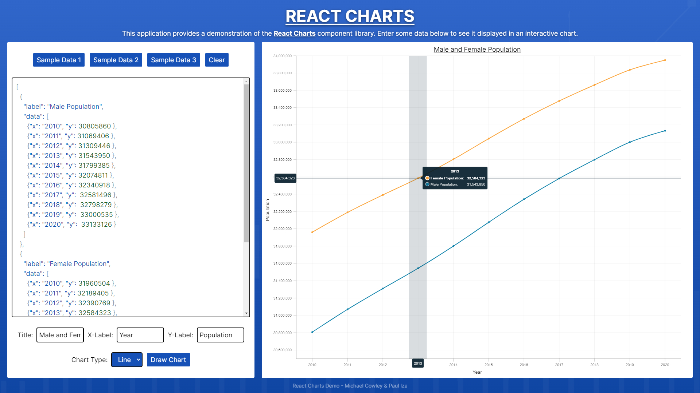
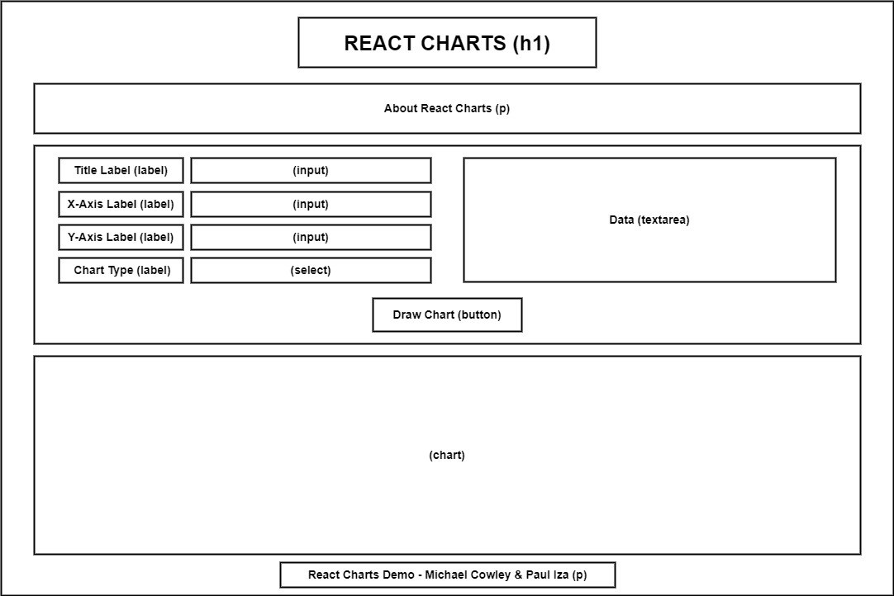

# React Charts

The application is deployed on Vercel and can be viewed [here](https://react-charts-ten.vercel.app/)

## About the project

This Next.js application provides a demo of the [React Charts](https://react-charts.tanstack.com/) library to generate appealing and flexible charts.

A user can input some JSON data using the [React Textarea Code Editor](https://uiwjs.github.io/react-textarea-code-editor/) or use the sample data provided and select the chart type to see the charts in action.



## Team members and project management

#### Contributors:

- Michael Cowley
- Paul Iza

#### Project management:

- **Trello:** We created a [Trello board](https://trello.com/b/QImak3my/react-charts-demo) to organise tasks and monitor our progress throughout development.
- **Shared Programming:** We utilised shared programming to collaborate on code development in real-time, ensuring all team members were involved and encourage sharing of knowledge.

## Wireframe

We made a wireframe during the planning phase of the project to design the layout and content of the webpage. However, we modified the layout during development to maximise space and improve visibility of the text area and chart by placing them side by side. We also added sample data buttons so the user can quickly generate a chart.



## User stories and problem domain

#### Project aim:

The aim of this project was to collaborate as a team and research a component library to implement. This involved reading documentation and exploring examples to understand how we can use the library in our project.

#### User stories:

- As a user, I want to be able to input data and see it displayed as a chart.
- As a user, I want to be able to select the chart type.
- As a user, I want the chart to be clear and appealing so the data can be easily interpreted.

#### Future additions:

- Implement a simpler method for inputting data rather than writing JSON.
- Allow more customisation of the chart, for example, setting the line/bar colour.

## Setup

#### Dependencies

- [React Charts](https://react-charts.tanstack.com/)
- [React Textarea Code Editor](https://uiwjs.github.io/react-textarea-code-editor/)

#### Getting started

This is a [Next.js](https://nextjs.org/) project bootstrapped with [`create-next-app`](https://github.com/vercel/next.js/tree/canary/packages/create-next-app).

First, run the development server:

```bash
npm run dev
# or
yarn dev
# or
pnpm dev
# or
bun dev
```

Open [http://localhost:3000](http://localhost:3000) with your browser to see the result.

You can start editing the page by modifying `app/page.js`. The page auto-updates as you edit the file.

This project uses [`next/font`](https://nextjs.org/docs/basic-features/font-optimization) to automatically optimize and load Inter, a custom Google Font.

## References

- [Favicon](https://www.flaticon.com/)
- [Background image](https://pngtree.com/freebackground/financial-technology-data-graph_1598391.html)
